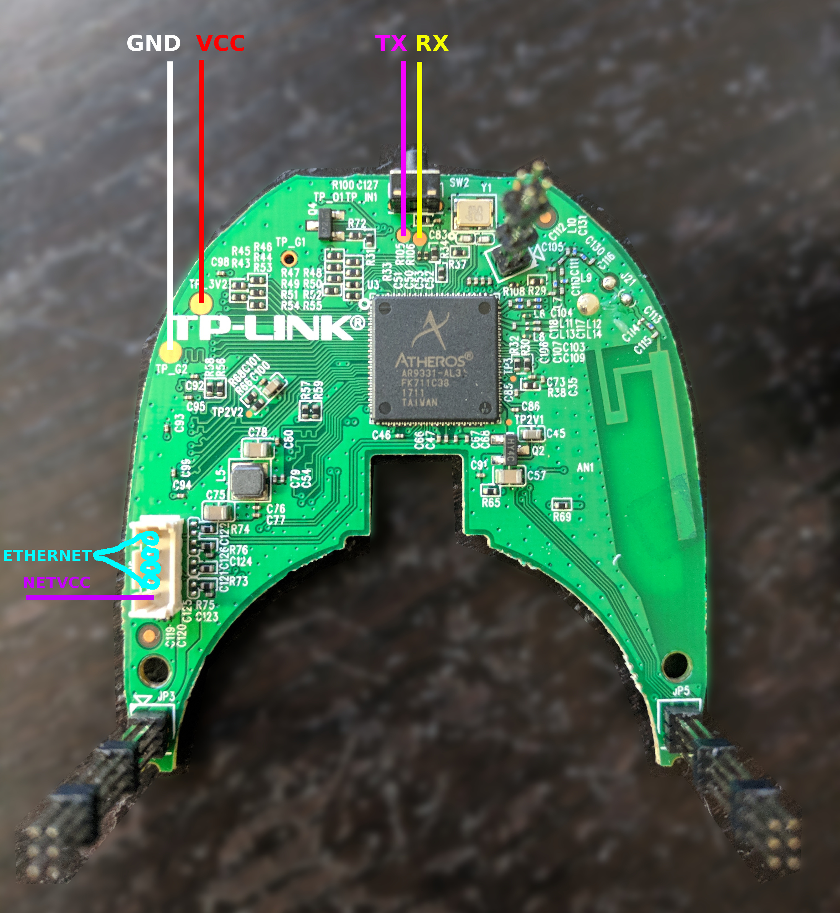
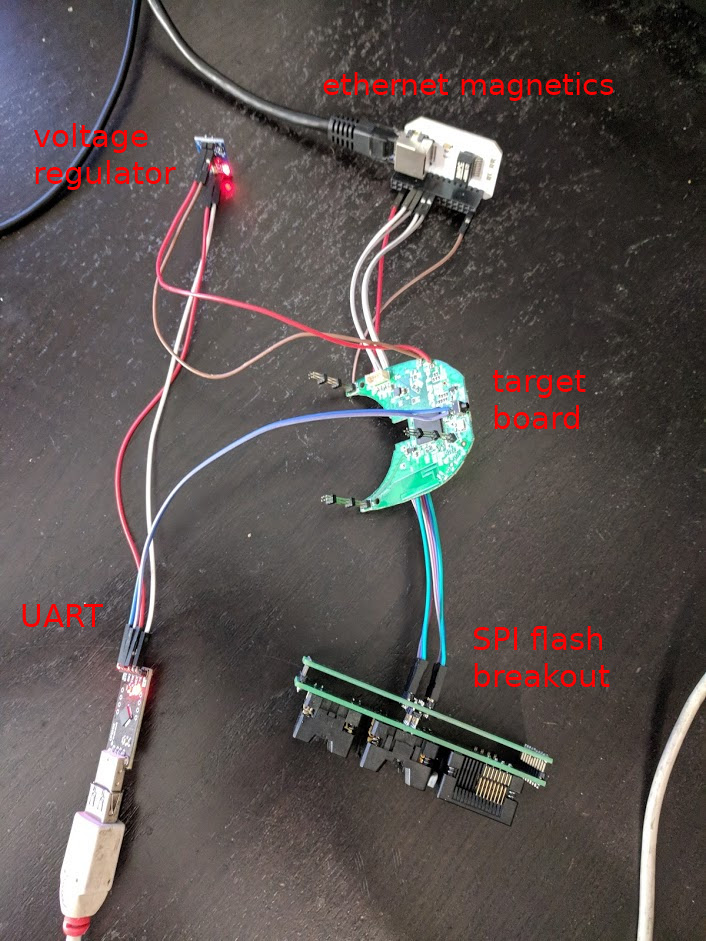

# archon on tplink hs110




### working with the prototype setup



for magnetics we use the [omega2 ethernet shield](https://github.com/OnionIoT/Onion-Hardware/blob/master/Schematics/Omega-Ethernet-Expansion.pdf)

flashing can be done by interrupting uboot

```
Hit any key to stop autoboot:  0 
ar7240> 
```
